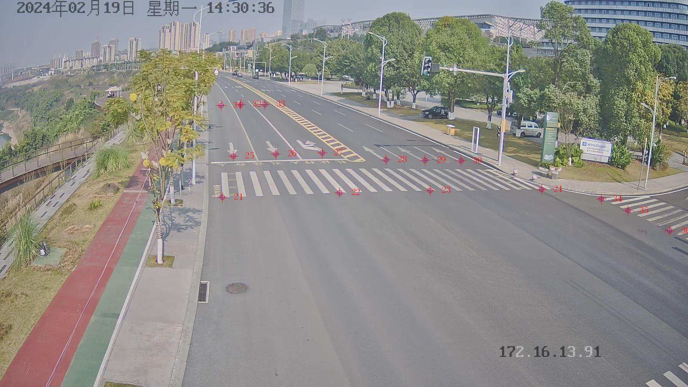

# 训练
- 将yolo待训练数据集放到data文件夹下，地址填写到 ultralytics/cfg/models/11/yolo11.yaml（根据自己的数据集填写）
- 运行 train.py 进行训练，训练结果会保存到runs文件夹

## H矩阵获取
- 本次测试参考点位图片为191.jpg, 采用21-33号点，第0列是序号，1、2列是rtk点，3、4列是image点，具体点信息可见calibrate.csv

- 首先需要计算映射矩阵H，将对应RTK点和图像点放到H_matrix.py对应_rtk和_image部分，运行H_matrix.py后获得H矩阵
```C++
$ python H_matrix.py 
H matrix:
[[ 4.7850893820477989e+02 -5.8755351975478598e+03  6.4838448141444067e+05]
 [ 2.4274073558009218e+03 -2.9802526830994153e+04  3.2888311128787268e+06]
 [ 7.3803236496884194e-04 -9.0614219797347118e-03  1.0000000000000000e+00]]
```
- 将H矩阵的值写到detec.py中

# 检测+跟踪
- 将需要检测的视频放到test.mp4
- 直接运行detec.py，会检测视频并返回跟踪后的结果。所有的结果需要映射到UTM坐标系（根据Homography矩阵映射）
- 类别id对应的值是训练的时候加载的datasets文件，即 model.train 下的data参数
- 最后结果需要输出为csv文件（可参考示例输出all_targets.csv），详细输出方式参考detec.py
- 参赛结果需以 CSV 文件格式提交，包含以下字段：

|字段名|	类型|	备注|
| -------- | ------ | --------|
|frame	|int	|视频帧号|
|id	|int	|跟踪ID|
|lon	|double	|经度（目标几何中心）|
|lat	|double|	纬度（目标几何中心）|

# 环境
- conda环境可以参考 environment.yaml


